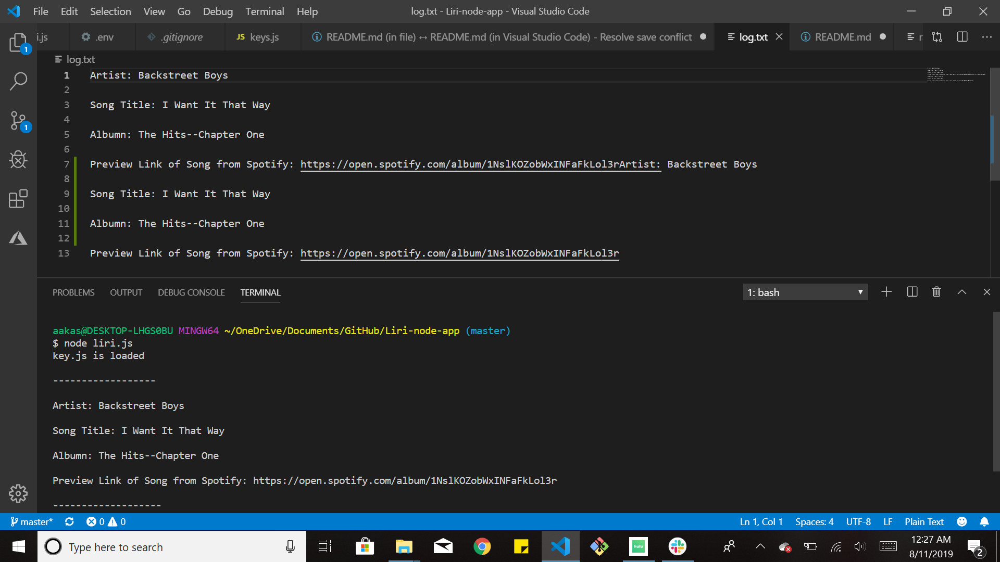

# Liri-node-app

### Overview

In this assignment, I created a script that is a _Language_ Interpretation and Recognition Interface. LIRI will be a command line node app that takes in parameters and gives you back data.

The parameters are:

* `concert`

* `spotifythis`

* `movie`


### What Each Command Does

1. `node liri.js concert <artist/band name here>`

* This will search the Bands in Town Artist Events API (`"https://rest.bandsintown.com/artists/" + artist + "/events?app_id=codingbootcamp"`) for an artist and render the following information about artist/band next event:

* Name of the venue

* Venue location

* Date of the Event (use moment to format this as "MM/DD/YYYY")

* Snapshot :

    


2. `node liri.js spotifythis <song name here>`

* This will show the following information about the song in your terminal/bash window

* Artist(s)

* The song name

* The album that the song is from

* A preview link of the song from Spotify

* If no song is provided then program will default to "I want it that way" by .

* Snapshot : 

    


3. `node liri.js movie'<movie name here>'`

* This will output the following information to your terminal/bash window:

```
* Title of the movie.
* Year the movie came out.
* IMDB Rating of the movie.
* Rotten Tomatoes Rating of the movie.
* Production house of the movie.
* Language of the movie.
* Plot of the movie.
* Actors in the movie.
```
* Snapshot : 

    


4. ` node liri.js `

* This will run the default command `spotifythis` and as a parameter it will search `I want it that way`.

* Snapshot: 

    


5. `logging data using fs.appendFile`

* This will append all the data to `log.txt`.  


* Snapshot: 

    


6. List of Node Package Manager

* `Axios`

* `Dotenv`    

* `Moment`

* `node-spotify-api`

* `File System`
